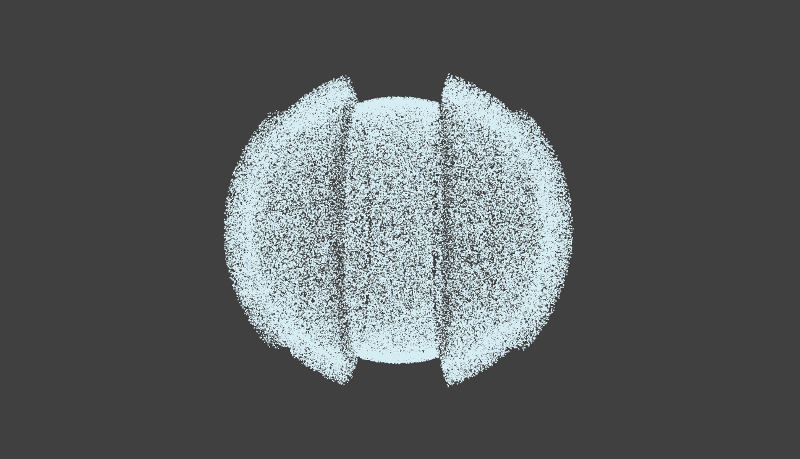
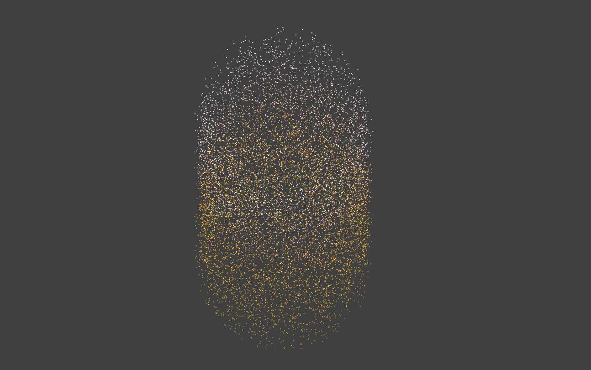
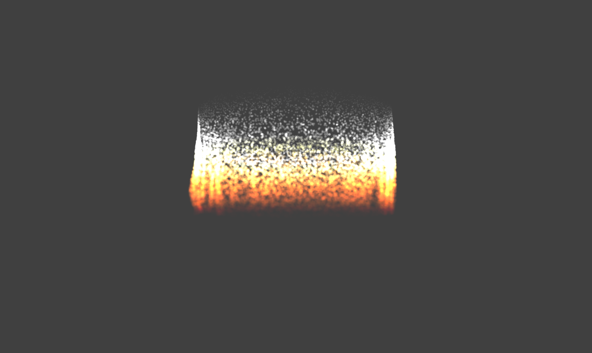

# 🔊 Audio Reactive Particle Visualizer (Three.js)

An audio-reactive particle visualizer built with **Three.js** and **TypeScript**.  
The project uses particle systems and shaders to visualize music in real time.

It supports **switching between multiple visual modes via UI buttons** and is designed to be easily extendable with new modes and controls.

---

## ✨ Features

- Real-time audio analysis (bass / mid / high)
- Particle system based on `THREE.Points`
- Shader-based GPU visualization
- Smooth mode switching without recreating the scene
- Interactive UI controls

---

## 🎨 Visualization Modes

### 1. Basic Sphere

Particles are evenly distributed on a sphere.  
The radius dynamically changes based on audio frequencies.

---

### 2. Capsule Mode

A vertically stretched, capsule-like shape.  
Particles move upward with a life cycle and color gradient, creating a jumping effect.

---

### 3. Fire Mode (Shader)

A fully shader-driven mode using `ShaderMaterial`.

- Animation controlled via `uniforms`
- Reaction to bass frequencies
- Fire-like motion without CPU geometry updates

---

## 🎛 UI Controls

- Buttons to switch between visualization modes:
  - Basic Sphere (button '1')
  - Capsule (button '2')
  - Fire (button '3')
- Play / pause music
- Volume cahnging via buttons +/-

---

## 🧩 TODO / Future Improvements

### Visual Modes

- Add new modes (smoke, waves, spiral, rings)
- Hybrid modes (fire + sparks, fire + smoke)

### UI & Interaction

- Add **music file selection from the user’s computer**
- Slider for particle count
- Volume slider
- Controls for bass / mid / high sensitivity
- Color preset switching

### Visual Quality

- Improved noise functions in shaders
- More organic fire motion
- Additional shader toggles via uniforms

### Audio controls

- Add more possibility to change audio settings and UI for it

---

## 📌 Notes

This project is intended as an **experimental real-time visualizer**, suitable as a base for:

- audio visualizations
- interactive WebGL experiments
- creative coding projects
